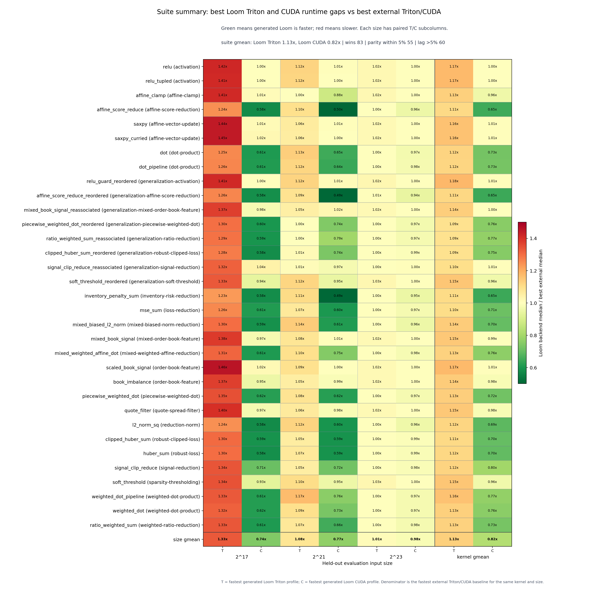
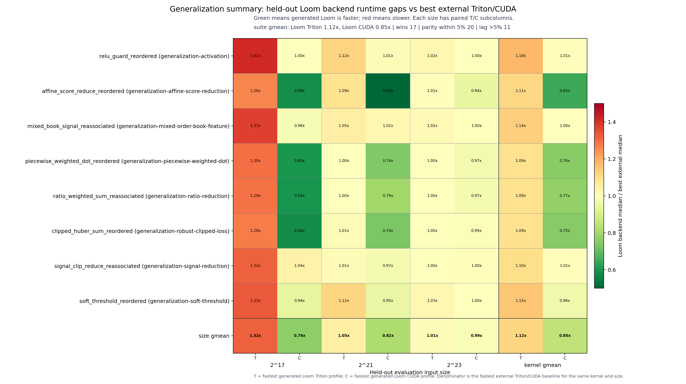

# Loom

Loom is a narrow, inspectable compiler from constrained OCaml, Python, and C++
tensor subsets to generated Triton Python kernels, generated CUDA shared
libraries, and packaged CUDA libraries.

The shared compiler core now lowers to `TensorIR` plus shared KernelPlan
semantics and body traits. Backend planning and codegen remain target-local:

- `FrontIR`
- `LoomLambda`
- `TensorIR`
- `TensorIR + KernelPlan traits -> TritonPlan -> Triton`
- `TensorIR + KernelPlan traits -> CudaPlan -> CUDA`

The current implementation is intentionally small:

- OCaml, Python, and Clang-AST C++ frontends lowering into the same `FrontIR`
- Triton and generated CUDA backends
- 1D contiguous `float32` tensors only
- explicit `[@loom.entry]`, `@loom.entry`, or `LOOM_ENTRY` entrypoints only
- `Loom.Tensor1.{map,map2,reduce_sum,reduce_max}` only

## Public Results Snapshot

The committed public benchmark snapshot compares the fastest generated Loom
Triton (`T`) and CUDA (`C`) profiles against the fastest external Triton/CUDA
baseline for the same kernel and input size. Green cells mean generated Loom is
faster; red cells mean slower.

**Current benchmark suite**

[](experiments/results/public/runtime/plots/suite_summary_cuda_gap.png)

**Held-out generalization suite**

[](experiments/results/public/runtime/plots/suite_summary_generalization_gap.png)

The full generated report, raw measurements, summaries, and per-kernel plots
live under [`experiments/results/public/`](experiments/results/public/).

## Docs

- Start here: [`docs/quickstart.md`](docs/quickstart.md)
- Design: [`docs/design/language-specs.md`](docs/design/language-specs.md)
- Architecture: [`docs/design/loom-design.md`](docs/design/loom-design.md)
- Optimizations: [`docs/design/optimizations.md`](docs/design/optimizations.md)
- IRs:
  [`docs/design/irs/front-ir.md`](docs/design/irs/front-ir.md),
  [`docs/design/irs/loomlambda.md`](docs/design/irs/loomlambda.md),
  [`docs/design/irs/tensor-ir.md`](docs/design/irs/tensor-ir.md),
  [`docs/design/irs/kernel-plan.md`](docs/design/irs/kernel-plan.md)
- Tools: [`docs/tools/tools-overview.md`](docs/tools/tools-overview.md)
- Experiments: [`experiments/README.md`](experiments/README.md)

## Build

Primary commands:

- `make ocaml-build`
- `make python-env`
- `make test`
- `make bench`
- `make experiments`

Python dependencies are managed with `uv` and pinned in `uv.lock`.

## Typical Flow

List annotated entrypoints in a source file:

```sh
dune exec ./src/loom_cli/loomc.exe -- list-entries examples/saxpy.ml
```

Compile one entrypoint to generated Triton artifacts:

```sh
dune exec ./src/loom_cli/loomc.exe -- \
  compile examples/saxpy.ml \
  --entry saxpy \
  --target triton \
  --out build/saxpy
```

The output directory contains the generated Triton module, shared IR dumps,
`triton_plan.json`, `backend_analysis.json`, a manifest, and a human-readable
report.

Compile one entrypoint to the generated CUDA backend:

```sh
dune exec ./src/loom_cli/loomc.exe -- \
  compile examples/saxpy.ml \
  --entry saxpy \
  --target cuda \
  --out build/saxpy-cuda
```

The CUDA compile output contains the same shared IR dumps plus
`cuda_plan.json`, `backend_analysis.json`, generated CUDA source, a generated
header, a built shared library, a manifest, and a report.

The compile path also accepts:

- `--backend triton|cuda` as an alias for `--target`
- `--emit <kind>` for partial artifacts; it defaults to `all`
- `--input-kind ocaml|python|cpp|front-ir`
- `--autotune`
- `--autotune-config <path>`
- `--cuda-arch sm_XX`
- `--cuda-platform generic|current`
- `--opt-config <path>`
- `--enable-opt <id>`
- `--disable-opt <id>`

Inspect supported optimization flags with:

```sh
dune exec ./src/loom_cli/loomc.exe -- list-opts
```

Package an OCaml Dune project into a linkable CUDA library with a C ABI:

```sh
dune exec ./src/loom_cli/loomc.exe -- \
  package \
  --project examples/package_project \
  --out build/package_project \
  --kind shared
```

Python source can be compiled through the same pipeline:

```sh
dune exec ./src/loom_cli/loomc.exe -- \
  compile examples/saxpy.py \
  --input-kind python \
  --entry saxpy \
  --target triton \
  --out build/saxpy-python
```

Python package builds use `--input-kind python` and scan `.py` files under the
project root. A `loom-package.json` file may provide the package name.

C++ source uses a Loom staged subset parsed through Clang AST:

```sh
dune exec ./src/loom_cli/loomc.exe -- \
  compile examples/saxpy.cpp \
  --input-kind cpp \
  --entry saxpy \
  --target cuda \
  --out build/saxpy-cpp-cuda
```

C++ package builds use `--input-kind cpp` and scan `.cpp`, `.cc`, and `.cxx`
files under the project root. `--input-kind auto` scans all active source
frontends.

The package output includes:

- `lib<project>.so` or `lib<project>.a`
- `include/loom/<project>.h`
- `src-gen/<project>.cu`
- `manifest.json`
- `report.md`
- per-entry IR dumps under `entries/`

## Experiments

The repository also includes reproducible experiment sources and generation
scripts under [`experiments/`](experiments/). The experiment harness now emits:

- Loom-internal comparisons across config-discovered optimization profiles and
  autotune states
- Loom-vs-others comparisons across `none/full x fixed/autotuned` Loom profiles,
  handwritten Triton in naive/optimized and fixed/autotuned variants, and
  handwritten C++ CUDA in naive/optimized variants

It also records capability checks for supported and unsupported staged
programs, runs an audit pass for workload/baseline drift, verifies
cross-implementation outputs on shared seeded datasets, splits tuning from
held-out evaluation data, and emits PNG plots plus a Markdown report. Backend
performance benchmark jobs use OCaml sources only when external Triton/CUDA
groups are present; frontend comparisons are isolated in their own result tree.
Local experiment outputs live under
`experiments/results/local/{compile,runtime,frontend,shared}/`, and the
repository may also carry a committed reference result set under
`experiments/results/public/`. Optimization-pass runs can execute in a
candidate-vs-baseline mode that reruns only modified Loom groups against an
accepted former-self baseline and skips autotuned groups for speed.
Raw experiment measurements are streamed to disk in batched
experiment-unit writes during execution, and the harness can rebuild final
summaries and plots from the persisted raw files via `--finalize-only`.
The separate `--frontend-comparison` harness mode benchmarks OCaml, Python, and
C++ frontend lowering plus full compile parity without adding those
measurements to the backend optimization result set. Add `--frontend-runtime`
for full-suite intra-Loom runtime parity checks across the three frontends;
these results stay under the separate `frontend/` result tree.

Public Loom CUDA results may use CUDA backend platform selection
(`--cuda-platform current`) when that profile is explicitly marked as
platform-specific. In that case, the result report lists the CUDA platform in
the profile table and adds a footnote clarifying that the numbers are tuned for
the benchmark host rather than fully portable generic CUDA codegen.

## License

Loom is licensed under the GNU General Public License v3.0. See
[`LICENSE`](LICENSE).

Copyright (C) 2026 Peisong Xiao <peisong.xiao.xps@gmail.com>
